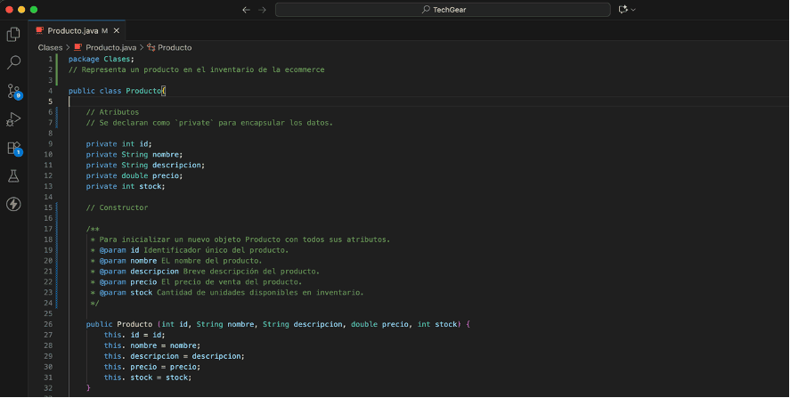

# TechGear "E-commerce"

Es un proyecto de comercio electrónico diseñado para la venta de productos tecnológicos. _"facilitando a los usuarios navegar por un catálogo de productos, agregarlos al carrito de compras, gestionar sus pedidos y realizar pagos de forma segura"_. 

_**El objetivo principal:**_ _es ofrecer una experiencia de compra fluida y eficiente, con una interfaz intuitiva y un backend robusto_.

En ese sentido, la propuesta del presente proyecto se centra en el diseño arquitectónico de **"TechGear"**, _una plataforma de que busca abordar los desafíos clave de este nicho, la compatibilidad y necesidad del cliente_.
## 🛠️ Tecnologías y Herramientas Utilizadas

El proyecto contempla un conjunto de tecnologías y herramientas que garantizan su funcionalidad, escalabilidad y seguridad.

**BackEnd:** 
- _Java (Lenguaje)_ 

- _JDK/JRE 24 (Máquina Virtual de Java)_

- _JUnit 5 (Jupiter) Framework de pruebas unitarias_
 

### _=== BackEnd ===_

## Clases
La implementación de las clases **“Producto, Usuario y CarritoDeCompra”** es clave para el correcto funcionamiento de la e-commerce, ya que encapsulan la información de los artículos, los compradores y la gestión de los productos seleccionados respectivamente, formando la base de la lógica de **"TechGear”**, mejorando la experiencia del cliente.

### _Extensión de Funcionalidades mediante Herencia_
Permite una gestión organizada, reutilización de código y una extensión flexible del sistema a medida que la e-commerce crece, optimizando la forma en que los “productos, clientes y el proceso de compra se manejan de forma estructurada y modular”.

## Aplicación de Polimorfismo y Sobrecarga
La implementación de polimorfismo y sobrecarga permite manejar diversas operaciones sobre productos y pedidos en la plataforma "TechGear”.

## Aplicación de Encapsulamiento y Abstracción
Permite ocultar la complejidad interna de un objeto (encapsulamiento) y presentar solo las características esenciales de manera simplificada (abstracción).

## Implementación de Interfaces y Clases Abstractas
Permiten definir qué deben hacer las clases (interfaces) o qué pueden heredar y completar las (clases abstractas), haciendo que el código sea más flexible y manejable.

### _=== FrontEnd ===_

## Maqueta de Plataforma eCommerce - TechGear
Contiene la maqueta inicial de la página web para la plataforma de eCommerce **TechGear** donde el uso de tecnologías para web modernas como HTML5, CSS3 y Tailwind CSS permite crear una interfaz de usuario atractiva, interactiva y responsiva.

El proyecto contempla un conjunto de tecnologías y herramientas que garantizan su funcionalidad, escalabilidad y seguridad.

**FrontEnd:** HTML5, CSS3, Tailwind CSS,

### Estructura de Archivos
/
|-- index.html      # Archivo principal de la página
|-- css/
|   |-- styles.css  # Estilos personalizados
|-- js/
|   |-- script.js   # Lógica de JavaScript

## Capturas de Pantalla
A continuación, se muestran vistas previas de la página en diferentes dispositivos.

### Vista de Escritorio (Desktop)
_Captura de pantalla de la vista de escritorio._

### Vista Móvil (Mobile)
_Captura de pantalla de la vista móvil._
